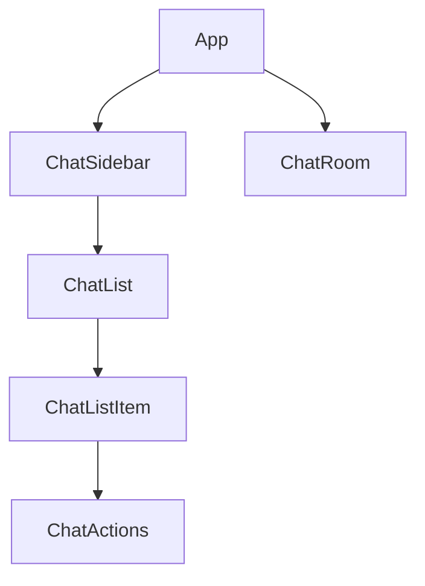

# Chat-Historie Implementierungsplan

Dieser Plan beschreibt die Integration einer MongoDB-basierten Chathistorie mit einer aufklappbaren Seitenleiste für die Theologen Taverne App.

## 1. Datenmodell

```javascript
// Chat-Modell
{
  _id: ObjectId,
  userId: String,        // Admin-ID oder Benutzer-ID
  title: String,         // Umbennenbarer Titel des Chats
  createdAt: Date,       // Erstellungsdatum
  updatedAt: Date,       // Datum der letzten Aktualisierung
  figures: [             // Beteiligte Figuren im Chat
    {
      id: String,
      name: String
    }
  ],
  messages: [            // Array von Nachrichten
    {
      figure: {
        id: String,
        name: String,
        image: String    // Bildpfad
      },
      text: String,
      timestamp: Date
    }
  ]
}
```

## 2. Server-Implementierung

### a) MongoDB-Verbindung und Schema

- Erstellen einer `db.js`-Datei für die Datenbankverbindung
- Definieren des Chat-Schemas mit Mongoose
- Erstellen eines Models für die Chat-Collection

### b) API-Endpunkte

Folgende API-Endpunkte werden benötigt:

- `GET /api/chats` - Liste aller Chats des angemeldeten Benutzers
- `GET /api/chats/:id` - Details eines spezifischen Chats
- `POST /api/chats` - Erstellen eines neuen Chats
- `PUT /api/chats/:id` - Aktualisieren eines Chats (z.B. Titel ändern)
- `PUT /api/chats/:id/messages` - Hinzufügen einer neuen Nachricht
- `DELETE /api/chats/:id` - Löschen eines Chats

## 3. Frontend-Implementierung

### a) Chat-Liste Component (links)



- `ChatSidebar`: Container für die Seitenleiste
- `ChatList`: Aufklappbare Liste der Chats
- `ChatListItem`: Einzelner Chat-Eintrag 
- `ChatActions`: Aktionen wie Umbenennen oder Löschen

### b) Integration mit bestehendem ChatRoom

- Anpassen des ChatRoom, um mit gespeicherten Chats zu arbeiten
- Speichern neuer Nachrichten in Echtzeit
- Laden früherer Nachrichten beim Öffnen eines Chats

### c) State-Management

- Erweiterung des AuthContext oder Erstellen eines neuen ChatContext
- Funktionen für das Laden, Speichern und Verwalten von Chats

## 4. Styling

- Anpassen des bestehenden Designs für die neue Seitenleiste
- Responsive Design für verschiedene Bildschirmgrößen
- Konsistente Styling-Regeln mit dem vorhandenen Design

## 5. Implementierungsreihenfolge

1. Server-Komponenten erstellen (Modelle, Controller, Routen)
2. Frontend ChatSidebar und ChatList-Komponenten erstellen
3. Integration mit ChatRoom-Komponente
4. Styling und UI-Optimierung

## Notizen

- Die Chats werden nach dem letzten Aktualisierungszeitpunkt sortiert (neueste zuerst)
- Jeder Benutzer sieht nur seine eigenen Gespräche
- Chats können umbenannt werden
- Beim Klicken auf einen Chat wird dieser geöffnet und kann fortgesetzt werden
- MongoDB Atlas wird für die Datenspeicherung verwendet (chatwithpeople.Chat Collection)