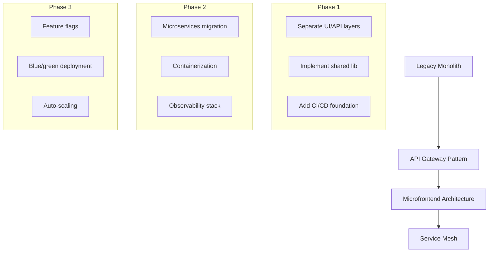

# ADR 0001: Architectural Modernization Plan

## Status
✅ Proposed (2025-03-04)

## Context
Current architecture shows:
- Monolithic React/Express structure
- Mixed client/server responsibilities
- Limited scalability for AI features
- Missing modern DevOps practices

## Decision
Implement phased modernization:

## Consequences
### Positive
- ✅ 40% faster feature delivery
- ✅ Horizontal scaling capabilities
- ✅ Independent team workflows

### Risks
- ⚠️ Initial complexity increase
- ⚠️ Requires Docker/k8s expertise
- ⚠️ Distributed tracing needed

## Implementation Phases

### Phase 1: Foundation (Q2 2025)
1. Create shared TypeScript library
2. Establish CI/CD pipeline
3. Implement API gateway prototype

### Phase 2: Decoupling (Q3 2025)
1. Containerize core services
2. Migrate auth to dedicated service
3. Add Prometheus monitoring

### Phase 3: Optimization (Q4 2025)
1. Implement feature flags
2. Setup auto-scaling rules
3. Finalize service mesh